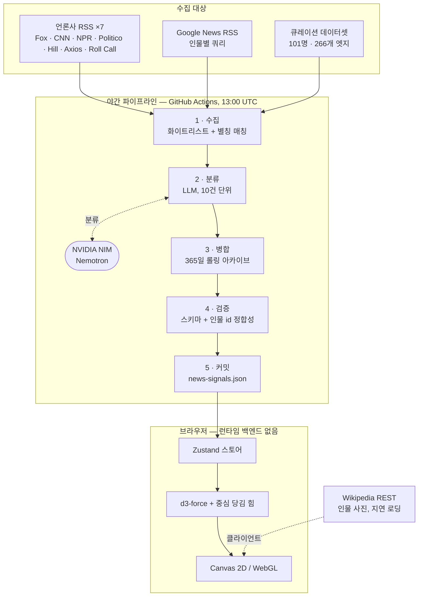

# POLARIS — 미국 정치인 관계 지도

[English](README.md) · **한국어**

**미국 정치에서 누가 누구와 손잡고 있고, 누가 누구와 등졌는지 — 그리고 그 관계가 시간에 따라 어떻게 뒤집히는지 보여주는 인터랙티브 그래프.**

101명, 266개의 큐레이션된 관계. 여기에 의회 법안 기록에서 직접 측정한 공동발의 엣지 112개.
매일 밤 정치 기사를 읽고 누가 누구와 틀어졌는지 LLM에게 물어, 그 답을 1년치 롤링 아카이브에 쌓는 파이프라인. 영어·한국어 완전 지원. 백엔드 없음 — 전부 정적 파일입니다.

### ▶ **[바로 보기](https://world-politicians.vercel.app/)** · [아키텍처](https://world-politicians.vercel.app/architecture) · [소스](https://github.com/showjihyun/world-politicians)

> **[world-politicians.vercel.app](https://world-politicians.vercel.app/)** 에서 바로 열립니다 — 가입 없이, 모바일에서도.

[](LICENSE)


---

### 무엇인가

정치 뉴스는 대개 사건의 나열로 소비됩니다. POLARIS는 그 아래 깔린 **구조**를 그리려는 시도입니다. 모든 엣지가 공개 보도에 근거한 실제 관계 — 동맹, 갈등, 초당적 다리, 정치 가족, 멘토·계승 — 이고, 그 위에 뉴스 레이어가 얹혀 지금 어떤 관계가 움직이고 있는지 보여줍니다.

화면이 드러내는 명제 하나: 현재 미국 정치는 두 개의 블록이 아니라 **하나의 허브와 수십 개의 축**입니다. 허브를 제거하면 네트워크는 둘로 갈라지는 게 아니라 흩어집니다.

### 기능

| | |
|---|---|
| **관계 그래프** | 행정부·상원·하원·주지사·비선출 권력에 걸친 101명을 2D 캔버스와 3D WebGL로. 두 모드 모두 Ctrl+드래그로 회전. |
| **범례가 곧 필터** | 좌측 하단 범례가 컨트롤입니다. 관계 유형을 끄면 해당 선이 사라지고, 남은 관계가 없어진 노드는 어두워집니다 — 그래프가 그냥 성겨지는 게 아니라 무엇이 걸러졌는지 보입니다. |
| **실시간 뉴스 와이어** | 인물별 최근 기사에 LLM이 동맹/갈등/중립 극성을 붙여 보여줍니다. |
| **관계 시계열** | 두 인물을 추적하면 ANALYSIS 탭이 월별 호불호 스트립을 그리고 변곡점을 표시합니다. 트럼프 × 머스크는 2025년 6월 결별과 2026년 1월 마라라고 화해가 그대로 드러납니다. |
| **가이드 스토리** | 구조적 패턴을 따라가는 큐레이션 투어 7편 — 마라라고 중력장, GOP 내전, 민주당 세대전쟁, 멸종위기의 초당적 다리. |
| **완전 이중언어** | 모든 레이블·설명과 LLM 요약이 영어·한국어로 존재합니다. 분류기가 한 번의 호출로 두 언어를 함께 씁니다. |
| **데이터 신선도 표시** | 수록된 기사의 실제 날짜 범위와 마지막 파이프라인 실행 경과를 배지로 — 24시간 이내 초록, 3일 이내 호박, 그 뒤 빨강. |

### 동작 방식



전체 기술 문서: **[아키텍처 &amp; 데이터 흐름](https://world-politicians.vercel.app/architecture)** — 파이프라인 단계, 렌더링 결정, 성능 개선 내역을 다이어그램과 함께. *(원본은 [`docs/architecture.html`](docs/architecture.html) 이며, GitHub 에서는 소스로만 보이니 위 링크를 이용하세요.)*

요약하면:

1. **수집** — 7개 언론사 RSS를 직접 폴링하고, 별칭 테이블로 만든 인물별 Google News 쿼리를 더합니다. Google News 결과는 17개 도메인·20개 매체명 화이트리스트를 통과해야 합니다. 데이터셋 인물이 2명 이상 등장한 기사만 페어 후보가 됩니다.
2. **분류** — 후보를 10건씩 묶어 LLM에 보내 해당 페어, 극성, 신뢰도, 이중언어 요약을 받습니다. API 키가 없으면 실패하는 대신 미분류 동반언급 신호로 격하됩니다.
3. **병합** — 새 신호를 기존 아카이브와 id 기준으로 합치고, 365일이 지난 것은 버리고, 1,500건에서 자릅니다. 한 번의 실행은 30일 창만 보지만, 이 아카이브가 시계열을 가능하게 합니다. 결과는 월별 파티션(`src/data/signals/YYYY-MM.json`)과 매니페스트, 그리고 작은 `recent.json` 으로 나눠 저장합니다. 브라우저는 시계열을 열 때만 전체 아카이브를 받으므로, 아카이브가 커져도 초기 로딩량은 그대로입니다.
4. **검증** — 스키마, 통계 일치, 참조된 인물 id의 실재 여부.
5. **커밋** — 워크플로가 JSON을 저장소에 다시 씁니다. 서버는 없습니다. 데이터셋은 정적 import로 함께 배포됩니다.

### 참조한 뉴스 소스

신호는 아래 매체에서만 수집합니다. 7곳은 RSS로 직접, 나머지는 Google News를 거쳐 화이트리스트로 걸러집니다.

**통신사·방송** — AP · Reuters · CNN · Fox News · NBC News · ABC News · CBS News · NPR
**정치 전문** — Politico · The Hill · Axios · Roll Call · Semafor · Washington Examiner
**전국지** — The New York Times · The Washington Post · The Wall Street Journal

인물 사진과 위키 링크는 **Wikipedia REST API**에서 브라우저가 지연 로딩합니다. 이미지 파일은 저장소에 두지 않습니다.

### 가져다 쓸 만한 기법

- **범례를 필터로 쓰고, 걸러진 노드를 어둡게.** 선만 감추면 그래프가 조용히 틀린 그림이 됩니다. 연결이 사라진 노드를 어둡게 해야 필터가 읽힙니다.
- **이상치가 아니라 본 덩어리에 맞춘다.** 모든 노드를 담으려는 `zoomToFit`은 멀리 떨어진 두어 개 때문에 정작 본 군집을 구석에 작게 만듭니다. 중심에서 가까운 97%에 맞추면 어떤 해상도에서도 화면을 채웁니다.
- **약한 중심 당김 힘.** 링크 없는 노드는 반발력만 받아 화면 밖으로 영원히 밀려납니다. 원점으로 살짝 당기면 레이아웃이 모이고, 프레이밍 문제도 뿌리에서 해결됩니다.
- **엔진이 멈춘 뒤, 딱 한 번 맞춘다.** 타이머로 맞추면 아직 퍼지는 중인 좌표에 맞춰지고, 멈출 때마다 맞추면 사용자가 돌려놓은 카메라를 매번 되감습니다.
- **3D 노드 오브젝트를 캐시하고 선택은 머티리얼만 수정.** `nodeThreeObject`를 인라인으로 두면 선택 상태를 클로저로 잡아, 클릭할 때마다 101개 노드의 지오메트리와 캔버스 텍스처가 통째로 재생성됩니다(프레임 167ms + GPU 누수). id로 캐시하고 색만 바꾸니 최악 프레임 50ms, 힙 69 → 40MB.
- **시계열 데이터는 덮어쓰지 말고 누적한다.** 원래 파이프라인은 매 실행마다 결과를 교체해서, 수집이 부실한 날 아카이브가 통째로 날아갈 수 있었습니다. 지금은 id 기준 병합 + 365일 창입니다.
- **매체명은 단어 경계로 매칭한다.** 화이트리스트의 맨 `'AP'` 하나를 부분일치로 쓰면 CoinG**ap**e, Yahoo News Sing**ap**ore, Tele**grap**hHerald가 조용히 통과합니다.

### 실행

데이터셋이 저장소에 함께 들어 있어, API 키나 별도 설정 없이 바로 실행됩니다.

```bash
npm install
npm run dev          # http://localhost:5173
npm run build

npm run news         # 뉴스 신호 갱신 (NEWS_LLM_API_KEY 필요)
npm run news:dry     # 같은 동작, 임시 파일에만 기록

node scripts/e2e/polaris.e2e.mjs    # 실제 브라우저 기반 45개 검사
node scripts/demo/record.mjs        # docs/demo.gif 재생성 (ffmpeg 필요)
```

LLM 단계는 OpenAI 호환 엔드포인트를 받습니다. 기본값은 NVIDIA NIM입니다.

```
NEWS_LLM_API_KEY=...
NEWS_LLM_BASE_URL=https://integrate.api.nvidia.com/v1
NEWS_LLM_MODEL=nvidia/nemotron-3-ultra-550b-a55b
```

### 솔직한 한계

- **두 종류의 엣지를 일부러 다르게 그립니다.** 266개의 큐레이션 엣지는 "이 둘은 동맹이다" 라는
  편집적 주장입니다. 공동발의 엣지는 "119대 의회에서 78건을 함께 발의했다" 는 측정값이고,
  GovInfo 의 BILLSTATUS 벌크 데이터에서 `bioguide` id 로 이어 붙였습니다. 점선과 별도 범례
  토글을 준 이유는, 판단과 측정을 같은 선으로 그리면 검증 가능한 쪽까지 신뢰를 잃기 때문입니다.
  기준선은 10건입니다 — 5건이면 264개가 추가되어 큐레이션한 266개가 묻히고, 10건 이상 쌍의
  84% 가 같은 당이라 원시 건수는 대부분 소속을 다시 쓴 것에 불과합니다. 흥미로운 것은 실제
  초당적인 11쌍입니다: Fitzpatrick × Gluesenkamp Perez(19건), Collins × Klobuchar(15건),
  Lawler × Torres(12건), Cruz × Warnock(9건). 여기서 "초당적" 은 정당 이름이 아니라
  **코커스**가 다르다는 뜻입니다 — Sanders 와 King 은 무소속이지만 민주당과 코커스하며,
  이들을 초당적으로 세는 바람에 앞선 작업에서 이 숫자가 11이 아닌 19로 부풀었습니다.
- **관계 데이터는 편집적 판단입니다.** 266개의 엣지는 공개 보도를 근거로 손으로 큐레이션한 것입니다. 같은 보도를 읽은 다른 사람은 다른 그래프를 그릴 것입니다. 기록이 아니라 하나의 주장으로 봐 주세요. 이제 모든 엣지에 근거 패널이 붙어 있습니다 — 관계 행의 문서 아이콘을 누르면 그 근거가 된 기사를, 없으면 없다는 사실을 볼 수 있습니다.
- **근거 링크는 검증 가능하며, 그 대가로 커버리지를 잃었습니다.** 이전 버전은 218개 엣지에 478개 링크가 있었지만 그중 94%가 Google News 리다이렉트였습니다. 이 주소는 브라우저에서만 열리고 목적지도 매체명도 확인할 방법이 없습니다. GDELT 아카이브의 원본 기사 URL 로 교체했고, LLM 관련성 필터를 거친 뒤 실제로 요청을 보내 응답하는지까지 확인했습니다(죽은 링크 5건 발견·제거). **결과는 266개 중 64개 엣지, 링크 162건 — 전부 누르기 전에 매체를 확인할 수 있는 원본 주소입니다.** 나머지 202개는 근거가 없다고 그대로 표시됩니다.
- **근거는 기계가 걸러낸 것이지 사람이 검증한 것이 아닙니다.** LLM 이 본문이 아니라 제목으로 판단하므로 애매한 건이 남습니다. 링크된 기사는 참고 맥락이지 사람이 확인한 인용이 아닙니다.
- **날짜의 의미가 출처마다 조금 다릅니다.** 뉴스 신호의 날짜는 RSS `pubDate`(발행일)입니다. 근거 링크의 날짜는 GDELT 의 `seendate` — 기사를 수집한 시각으로, 보통 발행일과 하루 안쪽이지만 같은 값은 아닙니다. 최근 보도는 Google News, 과거 사건은 GDELT 아카이브(2017년부터)에서 가져옵니다. 남은 48개는 대부분 두 소스 모두 닿지 않는 2017년 이전 관계입니다.
- **LLM 분류기는 팩트체커가 아닙니다.** 본문이 아니라 제목과 요약을 읽고, 틀릴 때가 있습니다. 극성은 신호이지 판정이 아닙니다.
- **커버리지는 전국 단위 영어 매체에 치우쳐** 있고, 따라서 그 매체들이 많이 다루는 인물에 치우칩니다.

### 배포

빌드 결과가 정적 번들이라 파일만 서빙하면 어디든 올라갑니다. 두 경로를 준비해 뒀습니다.

- **GitHub Pages** — `.github/workflows/pages.yml` 이 앱과 아키텍처 문서를 배포합니다.
  Pages 가 활성화돼 있지 않아 배포 단계가 실패하므로 자동 트리거는 주석 처리해 두었습니다.
  쓰시려면 저장소 *Settings → Pages → Source → GitHub Actions* 로 바꾼 뒤 `push` 트리거를
  되살리면 됩니다. 워크플로가 `PAGES_BASE` 를 넘겨 `/world-politicians/` 하위 경로에서
  자산이 해석되도록 합니다.
- **Vercel** — *현재 [world-politicians.vercel.app](https://world-politicians.vercel.app/) 로 서비스 중입니다.* `vercel.json` 이
  들어 있어 저장소를 import 하고 기본값 그대로 두면 됩니다. `npm run build` 후 문서를 `dist/` 로
  복사해 도메인 루트에서 서빙합니다(베이스 경로 불필요). `/assets/*` 는 immutable 캐시이고,
  `cleanUrls` 가 `.html` 을 떼므로 주소는 `/architecture` 입니다.

### 앞으로

스태퍼 네트워크, 기부 흐름, 로비 신고, 표결 기록까지 묶어 "누가 미국의 정책 결정에
영향을 주는가" 를 보여줄 수 있겠느냐는 제안을 받았습니다. 맞는 질문이고, 정직한
답에는 숫자가 붙습니다 — **101명 중 75명이 현직 또는 역대 의원과 매칭되고, 표결 기록은
56명, FEC id 는 75명입니다.** 다만 인물이 아니라 엣지로 보면 표결 데이터가 닿는 곳은
266개 중 의원↔의원 74개뿐입니다. 어떤 소스가 지금 접근 가능한지, 왜 수집보다 조인이 어려운지, 착수 전에
무엇을 정해야 하는지는 [`docs/roadmap.md`](docs/roadmap.md) 에 있습니다.

### 틀린 관계를 발견하셨다면

충분히 있을 수 있는 일입니다(위 한계 참고). 두 인물, 현재 엣지가 주장하는 내용,
그리고 그와 배치되는 보도 링크를 이슈로 올려 주세요. `src/data/relationships.ts` 의
수정 제안이 이 저장소에 가장 도움이 되는 기여입니다.

### 기술 스택

React 18 · TypeScript · Vite · Tailwind · Zustand · react-force-graph (d3-force + three.js) · Framer Motion · Playwright · 파이프라인은 Node 22 네이티브 TypeScript · GitHub Actions · 배포는 GitHub Pages

### 라이선스

MIT — [LICENSE](LICENSE) 참고.

---

## 관련 프로젝트

- **[showjihyun/KoreaPolitician](https://github.com/showjihyun/KoreaPolitician)** — 같은 아이디어를 한국 정치에 적용한 프로젝트.
