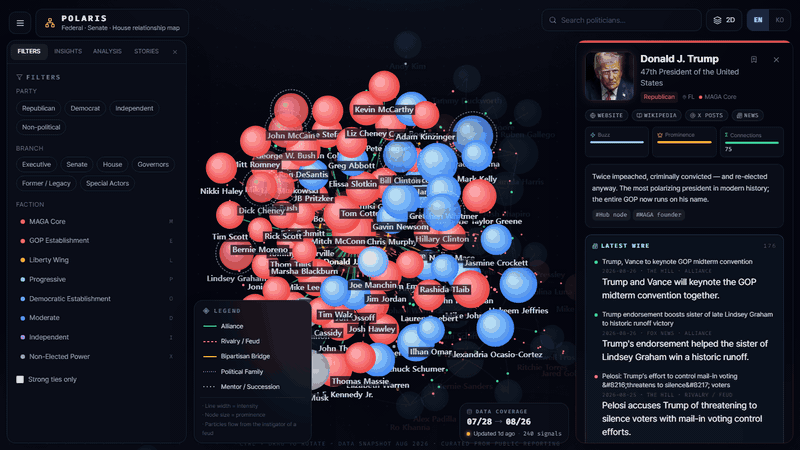
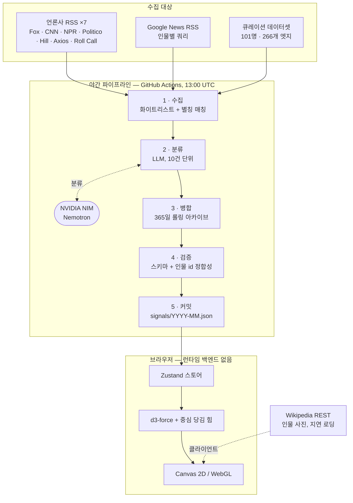

# POLARIS — 미국 정치인 관계 지도

[English](README.md) · **한국어**

**미국 정치에서 누가 누구와 손잡고 있고, 누가 누구와 등졌는지 — 그리고 그 관계가 시간에 따라 어떻게 뒤집히는지 보여주는 인터랙티브 그래프.**

101명, 266개의 큐레이션된 관계. 여기에 의회 법안 기록에서 직접 측정한 공동발의 엣지 112개.
매일 밤 정치 기사를 읽고 누가 누구와 틀어졌는지 LLM에게 물어, 그 답을 1년치 롤링 아카이브에 쌓는 파이프라인. 영어·한국어 완전 지원. 백엔드 없음 — 전부 정적 파일입니다.

### ▶ **[바로 보기](https://world-politicians.vercel.app/)** · [아키텍처](https://world-politicians.vercel.app/architecture) · [소스](https://github.com/showjihyun/world-politicians)

> **[world-politicians.vercel.app](https://world-politicians.vercel.app/)** 에서 바로 열립니다 — 가입 없이, 모바일에서도.

[](LICENSE)




---

### 무엇인가

정치 뉴스는 대개 사건의 나열로 소비됩니다. POLARIS는 그 아래 깔린 **구조**를 그리려는 시도입니다. 모든 엣지가 공개 보도에 근거한 실제 관계 — 동맹, 갈등, 초당적 다리, 정치 가족, 멘토·계승 — 이고, 그 위에 뉴스 레이어가 얹혀 지금 어떤 관계가 움직이고 있는지 보여줍니다.

화면이 드러내는 명제 하나: 현재 미국 정치는 두 개의 블록이 아니라 **하나의 허브와 수십 개의 축**입니다. 허브를 제거하면 네트워크는 둘로 갈라지는 게 아니라 흩어집니다.

### 기능

| | |
|---|---|
| **관계 그래프** | 행정부·상원·하원·주지사·비선출 권력에 걸친 101명을 2D 캔버스와 3D WebGL로. 두 모드 모두 Ctrl+드래그로 회전. |
| **범례가 곧 필터** | 좌측 하단 범례가 컨트롤입니다. 관계 유형을 끄면 해당 선이 사라지고, 남은 관계가 없어진 노드는 어두워집니다 — 그래프가 그냥 성겨지는 게 아니라 무엇이 걸러졌는지 보입니다. |
| **실시간 뉴스 와이어** | 인물별 최근 기사에 LLM이 동맹/갈등/중립 극성을 붙여 보여줍니다. |
| **관계 시계열** | 두 인물을 추적하면 ANALYSIS 탭이 월별 호불호 스트립을 그리고 변곡점을 표시합니다. 기사 한 건이 아니라 하루에 한 표로 세고, 반전은 반대편의 2배를 넘어야 인정하며, 매체 판정이 갈린 달은 색을 바꾸는 대신 빗금으로 표시합니다. 트럼프 × 머스크는 2025년 6월 결별과 2026년 1월 마라라고 화해가 그대로 드러납니다. |
| **소스 구성** | 인사이트 패널이 아카이브 전체를 매체별로 쪼개 얼마나 쏠려 있는지 보여주고, 극성이 제목만으로 판정된다는 사실을 같은 자리에 적습니다. |
| **가이드 스토리** | 구조적 패턴을 따라가는 큐레이션 투어 7편 — 마라라고 중력장, GOP 내전, 민주당 세대전쟁, 멸종위기의 초당적 다리. |
| **완전 이중언어** | 모든 레이블·설명과 LLM 요약이 영어·한국어로 존재합니다. 분류기가 한 번의 호출로 두 언어를 함께 씁니다. |
| **데이터 신선도 표시** | 수록된 기사의 실제 날짜 범위와 마지막 파이프라인 실행 경과를 배지로 — 24시간 이내 초록, 3일 이내 호박, 그 뒤 빨강. |
| **공동발의 레이어** | 119대 의회 법안 기록에서 측정한 엣지를 점선과 별도 범례 토글로. 한쪽이 서명을 도맡는 쌍에만 화살표가 붙습니다. |
| **영향력 프로필** | 의원 프로필에 FEC 선거자금, 로비스트로 등록한 전직 보좌진, 자기 당 다수와 반대로 던진 비율이 붙습니다. 각 수치가 무엇을 뜻하지 *않는지* 한 줄씩 함께 적습니다. |
| **근거 패널** | 관계 행의 문서 아이콘을 누르면 그 관계의 근거 기사가, 없으면 없다는 사실이 나옵니다. |

### 첫 공개 이후 개선된 것

POLARIS 는 2026년 8월 말 Reddit 에 처음 공유됐습니다. 댓글이 던진 어려운 질문은 둘이었습니다 —
*이걸로 누가 실제로 연방 정책 결정에 영향을 주는지 보일 수 있는가*, 그리고 *편향되고 자극적인
헤드라인으로 만든 그래프를 어디까지 믿을 수 있는가*. 그 뒤의 작업은 대부분 둘 중 하나에 대한 답입니다.

**새 데이터 레이어 — 큐레이션이 아니라 측정**

| | |
|---|---|
| **공동발의 엣지** | GovInfo BILLSTATUS 벌크 데이터에서 만든 신규 엣지 112개(공동발의 10건 이상). 측정값이 편집 판단으로 읽히지 않도록 큐레이션 엣지와 다르게 그립니다. 방향을 보존하고, "초당적" 은 정당 표기가 아니라 코커스로 판단합니다. |
| **선거자금** | 70명 프로필에 FEC 2026 주기 수입, 상위 PAC 후원자, 외부 지출. 후보를 *지지하는* 지출과 *반대하는* 지출을 나누고, 공동모금위원회 이체를 빼며, 환불은 음수로 둡니다. 이름이 붙는 PAC 자금이 전체의 약 6% 라는 사실도 화면에 적습니다. |
| **로비 회전문** | 하원 사무국의 LD-1 신고서 원본(2022~2026)에서 — 61명 밑에서 일했던 전직 보좌진 295명이 지금 등록 로비스트입니다. 매칭 근거가 된 신고서 문구를 함께 보여줍니다. 이름은 성이 아니라 전체 이름으로만 맞춥니다 — 역대 의원 중 Harris 만 33명입니다. |
| **당론 이탈률** | Voteview 호명투표로 잰, 양당이 갈린 표결(119대 1,279건)에서 자기 당 다수와 반대로 던진 비율. 64명. |
| **ID 크로스워크** | 현직 의원 전원과 그래프에 필요한 전직 의원을 bioguide · ICPSR · FEC id 로 잇습니다. 자동 이름 매칭이 놓친 경우(Mike ↔ Michael, Dick ↔ Richard)는 짐작하지 않고 사람이 확인해 파일에 적었습니다. |

자금·로비·이탈률은 그래프가 아니라 프로필에 있습니다. 공유 후원자, PAC 비중, 이탈률 대 당내 갈등 —
관계 신호로 써 보려고 각각 재 봤지만 누가 동맹이고 누가 갈등인지를 예측한 것은 하나도 없었습니다.
Collins 와 Fitzpatrick 은 이탈률 최상위인데 당내 갈등이 하나도 없습니다 — 조용하고 꾸준한 이탈은 공개 충돌을 낳지 않습니다.

**신뢰와 측정**

- **분류기에 점수를 매깁니다.** `npm run eval` 이 고정된 층화 표본 라벨 세트로 LLM 을 채점합니다
  (수치와 그 한계는 *솔직한 한계* 참고). 가장 큰 오류군은 동맹/갈등을 뒤집는 것이 아니라 중립 기사를 갈등으로 읽는 것입니다.
- **언론 편향은 프롬프트가 아니라 집계에서 다룹니다** — 아래 블록 참고.
- **"미판정" 을 숨기지 않습니다.** 분류에 실패한 기사는 다음 실행에서 다시 시도하고, 판정이 붙기 전까지는
  약한 신호처럼 조용히 지나가지 않고 *미판정* 으로 표시됩니다.
- **같은 기사는 한 번만.** 헤드라인이 고쳐지거나 `Video` 판이 나오면 새 id 로 다시 쌓이던 것을, URL 과 관계쌍으로 한 번 더 거릅니다.

**언론 편향 보완**

"언론의 편향 보도와 자극적인 헤드라인 때문에 뉴스로 만든 그래프는 믿기 어렵다" 는 지적을 받았습니다.
맞는 말이고, 프롬프트를 고치는 것만으로는 해결되지 않습니다. 언론 편향 연구(D'Alessio & Allen 메타분석,
Groseclose & Milyo, Gentzkow & Shapiro, 부정성 편향의 Soroka — [정리](docs/research/media-bias-literature.md))는
편향을 세 층으로 나누는데, 파이프라인에는 세 층이 다 있었습니다.

| 층 | 여기서의 의미 | 한 일 |
|---|---|---|
| **게이트키핑** — 무엇이 뉴스가 되는가 | 동맹/갈등 헤드라인의 3분의 2 가 갈등이었습니다 | 세는 방식을 바꿔(아래) 시끄러운 기사 하나가 한 달을 정하지 못하게 |
| **가시성** — 누가 다뤄지는가 | 조사 시점 신호의 71% 에 트럼프 | 화면에 적기만 하고 보정하지 않음 — 계산이 아니라 수집 구성의 문제 |
| **논조** — 어떻게 서술되는가 | LLM 의 극성 판정 | 라벨 세트로 채점, 매체명 편향 실험 |

시계열에서 바뀐 것 (`src/domain/timeline.ts`):

- **기사 한 건이 아니라 하루에 한 표.** 다섯 매체가 같은 사건을 쓰면 표가 다섯 장이었습니다. 이제 하루는
  한 표이고 가중은 `1 + ln(매체 수)`, 그날 보도의 3분의 2 가 같은 쪽일 때만 표를 던집니다. 결정적 표가
  244장에서 175장으로 줄었습니다. 처음에는 제목 유사도로 사건을 묶으려 했지만 양방향으로 틀려서 버렸습니다 —
  "Trump blames … on Walz" 와 "Fact check: Trump baselessly claims Walz …" 는 같은 사건인데 J = 0.10 입니다.
- **2:1 우위가 있어야 그 달의 색이 뒤집힙니다.** 예전에는 그 달의 첫 비중립 헤드라인이 색을 정해서,
  갈등 헤드라인 한 건이 뒤이은 동맹 헤드라인 여섯 건을 이겼습니다. 진짜 반전(트럼프 × 머스크)은 여러 매체가
  여러 날 다루므로 기준을 넘고, 자극적인 헤드라인 한 건은 넘지 못합니다. 셀 3개가 바뀌었습니다 — 예를 들어
  2026년 8월 Jeffries × Trump 는 갈등 5건 대 동맹 2건인데 *동맹* 으로 나가고 있었습니다.
- **판정이 갈리면 고르지 않고 보여줍니다.** Fox 는 Graham × Trump 를 동맹으로, CBS 는 갈등으로 보도한 달은
  한쪽을 고르는 대신 빗금으로 표시합니다.
- **소스 구성을 화면에 둡니다.** 인사이트 패널이 매체별 비중과 쏠림 정도를 보여주고, 극성이 제목만으로
  판정된다는 사실을 함께 적습니다.

시험해 보고 버린 것:

- **분류기의 매체명 편향.** 같은 헤드라인 14건에서 매체명을 Fox News 와 NPR 로 바꿔 넣었습니다(제목 끝의 매체
  접미사도 지웠습니다). **극성이 바뀐 것은 14건 중 0건**이었고, 같은 입력을 다시 돌렸을 때의 흔들림은 최대
  13% 였습니다. 계획했던 "매체명을 가린 두 번째 판정" 은 버렸습니다 — 측정되지 않는 효과를 고치느라 비용을
  두 배로 쓸 근거가 없습니다.

데이터를 기다리는 것과 그 이유:

- **갈등을 자주 외치는 매체에 낮은 가중.** 중립 기준이 될 통신사(AP·Reuters)의 기사가 십여 건뿐이라, 보정해도
  대부분 전체 평균을 되풀이합니다. 통신사 피드를 늘리는 것이 먼저입니다.
- **실측 오판율로 갈등 헤드라인을 할인.** 라벨상 가장 큰 누수는 중립 → 갈등(약 30%)이지만, 라벨 대부분을
  모델이 채웠습니다. 그 값을 쓰면 모델이 자기를 채점하는 셈이므로 사람 라벨 40건 뒤로 미룹니다.
- **부호 있는 삼각형의 구조 균형 검사.** 뉴스로 만들어지는 삼각형 39개 중 37개가 트럼프를 지나서, 검사가
  사실상 "트럼프와의 관계와 일관되는가" 만 묻게 됩니다.

**파이프라인 안정성**

- **실패한 LLM 배치가 아카이브를 지우지 못합니다.** 기사가 미분류로 돌아오면 병합은 아카이브에 이미 있던 판정을 지킵니다.
  수정 전에 지워진 판정은 git 이력에서 되살렸습니다(`npm run news:recover`).
- **야간 실행이 실패하면 GitHub 이슈가 열립니다.** 파이프라인이 사흘 동안 아무도 모르게 죽어 있었던 적이 있습니다.
- **`npm run audit` 이 이 README 를 데이터와 대조합니다.** 검사 대상 수치는 매번 다시 계산하고, 어긋나면 경고합니다. 각 규칙은 일부러 틀린 값을 먹여 본 뒤에 믿었습니다.

**화면**

- 이름 라벨을 프레임마다 한 번에 배치해 서로 겹치지 않습니다.
- 그래프의 3분의 1 이 옆 패널 뒤에 그려지던 것을, 실제로 보이는 영역에 맞춥니다.
- 휴대폰에서는 헤더 컨트롤이 접히고, 최소 글자 크기를 키웠습니다.
- 흐름 입자는 방향이 기록된 엣지에서만 흐릅니다.

### 동작 방식


```mermaid
flowchart TB
    subgraph S["수집 대상"]
        A["언론사 RSS ×7<br/>Fox · CNN · NPR · Politico · Hill · Axios · Roll Call"]
        B["Google News RSS<br/>인물별 쿼리"]
        C["큐레이션 데이터셋<br/>101명 · 266개 엣지"]
    end

    subgraph P["야간 파이프라인 — GitHub Actions, 13:00 UTC"]
        D["1 · 수집<br/>화이트리스트 + 별칭 매칭"]
        E["2 · 분류<br/>LLM, 10건 단위"]
        L(["NVIDIA NIM<br/>Nemotron"])
        F["3 · 병합<br/>365일 롤링 아카이브"]
        G["4 · 검증<br/>스키마 + 인물 id 정합성"]
        H["5 · 커밋<br/>signals/YYYY-MM.json"]
    end

    subgraph B2["브라우저 — 런타임 백엔드 없음"]
        I["Zustand 스토어"]
        J["d3-force + 중심 당김 힘"]
        K["Canvas 2D / WebGL"]
    end

    A --> D
    B --> D
    C --> D
    D --> E --> F --> G --> H
    E <-. 분류 .-> L
    H --> I --> J --> K
    W["Wikipedia REST<br/>인물 사진, 지연 로딩"] -. 클라이언트 .-> K
```

전체 기술 문서: **[아키텍처 &amp; 데이터 흐름](https://world-politicians.vercel.app/architecture)** — 파이프라인 단계, 렌더링 결정, 성능 개선 내역을 다이어그램과 함께. *(원본은 [`docs/architecture.html`](docs/architecture.html) 이며, GitHub 에서는 소스로만 보이니 위 링크를 이용하세요.)*

요약하면:

1. **수집** — 7개 언론사 RSS를 직접 폴링하고, 별칭 테이블로 만든 인물별 Google News 쿼리를 더합니다. Google News 결과는 17개 도메인·20개 매체명 화이트리스트를 통과해야 합니다. 데이터셋 인물이 2명 이상 등장한 기사만 페어 후보가 됩니다.
2. **분류** — 후보를 10건씩 묶어 LLM에 보내 해당 페어, 극성, 신뢰도, 이중언어 요약을 받습니다. API 키가 없으면 실패하는 대신 미분류 동반언급 신호로 격하됩니다.
3. **병합** — 새 신호를 기존 아카이브와 id 기준으로 합치고, 365일이 지난 것은 버리고, 1,500건에서 자릅니다. 다시 수집된 기사가 아카이브에 이미 있는 판정을 덮어쓰지 않으므로, LLM 배치가 실패해도 잃는 것이 없습니다. 한 번의 실행은 30일 창만 보지만, 이 아카이브가 시계열을 가능하게 합니다. 결과는 월별 파티션(`src/data/signals/YYYY-MM.json`)과 매니페스트, 그리고 작은 `recent.json` 으로 나눠 저장합니다. 브라우저는 시계열을 열 때만 전체 아카이브를 받으므로, 아카이브가 커져도 초기 로딩량은 그대로입니다.
4. **검증** — 스키마, 통계 일치, 참조된 인물 id의 실재 여부.
5. **커밋** — 워크플로가 JSON을 저장소에 다시 씁니다. 서버는 없습니다. 데이터셋은 정적 import로 함께 배포됩니다.

### 참조한 뉴스 소스

신호는 아래 매체에서만 수집합니다. 7곳은 RSS로 직접, 나머지는 Google News를 거쳐 화이트리스트로 걸러집니다.

**통신사·방송** — AP · Reuters · CNN · Fox News · NBC News · ABC News · CBS News · NPR
**정치 전문** — Politico · The Hill · Axios · Roll Call · Semafor · Washington Examiner
**전국지** — The New York Times · The Washington Post · The Wall Street Journal

인물 사진과 위키 링크는 **Wikipedia REST API**에서 브라우저가 지연 로딩합니다. 이미지 파일은 저장소에 두지 않습니다.

### 가져다 쓸 만한 기법

- **범례를 필터로 쓰고, 걸러진 노드를 어둡게.** 선만 감추면 그래프가 조용히 틀린 그림이 됩니다. 연결이 사라진 노드를 어둡게 해야 필터가 읽힙니다.
- **이상치가 아니라 본 덩어리에 맞춘다.** 모든 노드를 담으려는 `zoomToFit`은 멀리 떨어진 두어 개 때문에 정작 본 군집을 구석에 작게 만듭니다. 중심에서 가까운 97%에 맞추면 어떤 해상도에서도 화면을 채웁니다.
- **약한 중심 당김 힘.** 링크 없는 노드는 반발력만 받아 화면 밖으로 영원히 밀려납니다. 원점으로 살짝 당기면 레이아웃이 모이고, 프레이밍 문제도 뿌리에서 해결됩니다.
- **엔진이 멈춘 뒤, 딱 한 번 맞춘다.** 타이머로 맞추면 아직 퍼지는 중인 좌표에 맞춰지고, 멈출 때마다 맞추면 사용자가 돌려놓은 카메라를 매번 되감습니다.
- **3D 노드 오브젝트를 캐시하고 선택은 머티리얼만 수정.** `nodeThreeObject`를 인라인으로 두면 선택 상태를 클로저로 잡아, 클릭할 때마다 101개 노드의 지오메트리와 캔버스 텍스처가 통째로 재생성됩니다(프레임 167ms + GPU 누수). id로 캐시하고 색만 바꾸니 최악 프레임 50ms, 힙 69 → 40MB.
- **시계열 데이터는 덮어쓰지 말고 누적한다 — 병합 안쪽까지.** 원래 파이프라인은 매 실행마다 결과를 교체해서, 수집이 부실한 날 아카이브가 통째로 날아갈 수 있었습니다. id 기준 병합 + 365일 창으로 고쳤지만 절반만 고친 것이었습니다 — 다시 수집된 기사의 LLM 배치가 실패하면 미분류로 돌아와 병합에서 이기면서, 아카이브에 이미 있던 극성을 지웠습니다. 에러도 로그도 없이 하룻밤에 25건이 사라졌습니다. 침묵은 "원본 유지" 여야 하고, 지워진 판정은 `npm run news:recover` 로 git 이력에서 되살렸습니다.
- **매체명은 단어 경계로 매칭한다.** 화이트리스트의 맨 `'AP'` 하나를 부분일치로 쓰면 CoinG**ap**e, Yahoo News Sing**ap**ore, Tele**grap**hHerald가 조용히 통과합니다.
- **아무것도 매칭하지 않는 검사는 "통과" 라고 보고한다.** 감사 규칙 두 개가 이 README 의 수치를 정규식으로 데이터와 대조하고 있었습니다. 어느 시점에 문장이 바뀌면서 패턴이 빗나갔고, 감사는 계속 초록불을 찍었습니다 — 한국어 README 는 살아 있는 검사가 아예 없었습니다. 매칭 0건과 통과는 밖에서 구분되지 않고, 그래서 죽은 검사는 없는 것보다 나쁩니다. 치르지 않은 값으로 안심을 삽니다. 지금은 문서 수치 규칙이 패턴을 못 찾으면 그 사실을 보고하고, 새 검사는 일부러 틀린 값을 먹여 본 뒤에만 믿습니다.

### 실행

데이터셋이 저장소에 함께 들어 있어, API 키나 별도 설정 없이 바로 실행됩니다.

```bash
npm install
npm run dev          # http://localhost:5173
npm run build

npm test             # 순수 도메인 단위 테스트 (~1초)
npm run audit        # 경계 + 데이터 감사 — 종료 코드로 판정
npm run e2e          # 실제 브라우저 기반 검사 (~90초)
npm run eval         # 라벨 세트로 분류기 정확도 채점

npm run news         # 뉴스 신호 갱신 (NEWS_LLM_API_KEY 필요)
npm run news:dry     # 같은 동작, 임시 파일에만 기록
npm run news:recover:dry   # git 이력에서 되살릴 수 있는 판정 미리보기

node scripts/demo/record.mjs        # docs/demo.gif 재생성 (ffmpeg 필요)
```

중요한 것은 `npm run audit` 입니다. 이 README 의 수치를 데이터에서 다시 계산해 어긋나면
경고하고, 도메인 층이 값 import 를 갖지 않는지 검사하며, 매니페스트 합계가 요약 대상인
파티션과 어긋나면 통과시키지 않습니다.

LLM 단계는 OpenAI 호환 엔드포인트를 받습니다. 기본값은 NVIDIA NIM입니다.

```
NEWS_LLM_API_KEY=...
NEWS_LLM_BASE_URL=https://integrate.api.nvidia.com/v1
NEWS_LLM_MODEL=nvidia/nemotron-3-ultra-550b-a55b
```

### 솔직한 한계

- **두 종류의 엣지를 일부러 다르게 그립니다.** 266개의 큐레이션 엣지는 "이 둘은 동맹이다" 라는
  편집적 주장입니다. 공동발의 엣지는 "119대 의회에서 78건을 함께 발의했다" 는 측정값이고,
  GovInfo 의 BILLSTATUS 벌크 데이터에서 `bioguide` id 로 이어 붙였습니다. 점선과 별도 범례
  토글을 준 이유는, 판단과 측정을 같은 선으로 그리면 검증 가능한 쪽까지 신뢰를 잃기 때문입니다.
  기준선은 10건입니다 — 5건이면 264개가 추가되어 큐레이션한 266개가 묻히고, 10건 이상 쌍의
  84% 가 같은 당이라 원시 건수는 대부분 소속을 다시 쓴 것에 불과합니다. 흥미로운 것은 실제
  공동발의에는 방향이 있습니다 — B 가 A 의 법안에 서명한 것이지 그 반대가 아닙니다.
  한쪽으로 65% 이상 기운 쌍에는 화살표를 그리고(125개 중 59개), 나머지는 상호적으로
  둡니다. 이걸 합쳐버리면 `Kim 이 Warren 의 법안에 15회 서명, Warren 은 0회` 와
  `Padilla ⇄ Sanders 15 대 15` 가 똑같이 보입니다.
  초당적인 11쌍입니다: Fitzpatrick × Gluesenkamp Perez(19건), Collins × Klobuchar(15건),
  Lawler × Torres(12건), Cruz × Warnock(9건). 여기서 "초당적" 은 정당 이름이 아니라
  **코커스**가 다르다는 뜻입니다 — Sanders 와 King 은 무소속이지만 민주당과 코커스하며,
  이들을 초당적으로 세는 바람에 앞선 작업에서 이 숫자가 11이 아닌 19로 부풀었습니다.
- **돈은 그래프가 아니라 프로필에 있고, 이름이 붙는 건 6%뿐입니다.** FEC 벌크 데이터로
  각 인물의 2026 주기 총 수입, 최대 PAC 후원처, 외부 지출을 보여줍니다. 같은 FEC 파일에
  세 가지가 섞여 있어 반드시 갈라야 합니다 — 직접 기부($32.0M), 후보를 **지지**하는
  독립지출($14.4M), 후보를 **반대**하는 독립지출($18.1M). 반대 쪽이 가장 큽니다.
  합쳤다면 Thomas Massie 를 공격하는 데 쓴 $10.1M 이 그의 후원금으로 표시됐을 것입니다.
  공동모금 이체도 뺐습니다 — 안 뺐다면 Mike Johnson 의 1위 "후원자" 가 본인 위원회였습니다.
  남는 PAC 기부는 총 수입의 6% 이고, 73% 는 이름 없이 총액으로만 신고되는 개인 기부입니다.
  패널에 그대로 적어 두었습니다. 그래프 레이어가 아닌 이유는 데이터가 받쳐주지 않아서입니다 —
  상위 후원자를 8개 이상 공유하는 쌍이 5개뿐이고 전부 같은 코커스입니다.
- **관계 데이터는 편집적 판단입니다.** 266개의 엣지는 공개 보도를 근거로 손으로 큐레이션한 것입니다. 같은 보도를 읽은 다른 사람은 다른 그래프를 그릴 것입니다. 기록이 아니라 하나의 주장으로 봐 주세요. 이제 모든 엣지에 근거 패널이 붙어 있습니다 — 관계 행의 문서 아이콘을 누르면 그 근거가 된 기사를, 없으면 없다는 사실을 볼 수 있습니다.
- **근거 링크는 검증 가능하며, 그 대가로 커버리지를 잃었습니다.** 이전 버전은 218개 엣지에 478개 링크가 있었지만 그중 94%가 Google News 리다이렉트였습니다. 이 주소는 브라우저에서만 열리고 목적지도 매체명도 확인할 방법이 없습니다. GDELT 아카이브의 원본 기사 URL 로 교체했고, LLM 관련성 필터를 거친 뒤 실제로 요청을 보내 응답하는지까지 확인했습니다(죽은 링크 5건 발견·제거). **266개 중 64개에 근거가 있고, 링크는 162건 — 전부 누르기 전에 매체를 확인할 수 있는 원본 주소입니다.** 나머지 202개는 근거가 없다고 그대로 표시됩니다.
- **근거는 기계가 걸러낸 것이지 사람이 검증한 것이 아닙니다.** LLM 이 본문이 아니라 제목으로 판단하므로 애매한 건이 남습니다. 링크된 기사는 참고 맥락이지 사람이 확인한 인용이 아닙니다.
- **날짜의 의미가 출처마다 조금 다릅니다.** 뉴스 신호의 날짜는 RSS `pubDate`(발행일)입니다. 근거 링크의 날짜는 GDELT 의 `seendate` — 기사를 수집한 시각으로, 보통 발행일과 하루 안쪽이지만 같은 값은 아닙니다. 최근 보도는 Google News, 과거 사건은 GDELT 아카이브(2017년부터)에서 가져옵니다. 남은 48개는 대부분 두 소스 모두 닿지 않는 2017년 이전 관계입니다.
- **LLM 분류기는 팩트체커가 아닙니다.** 본문이 아니라 제목과 요약을 읽고, 틀릴 때가 있습니다. 극성은 신호이지 판정이 아닙니다.
- **정확도를 재고 있지만 아직 기준선은 아닙니다.** `npm run eval` 이 층화 표본 라벨 세트로
  채점합니다 — **기사 118건에서 극성 84.7%, 관계쌍 87.3%.** 오류는 한쪽으로 쏠려 있습니다.
  18건 중 10건이 중립 기사를 feud 로 부른 것이고, 진짜로 ally 와 feud 가 뒤집힌 것은 1건뿐입니다.
  즉 실패 방식은 "편을 잘못 고른다" 가 아니라 "두 이름이 같이 나온 것을 싸움으로 본다" 입니다.
  한 달의 색이 헤드라인 하나가 아니라 여러 매체·여러 날의 합의를 필요로 하게 바꾼 이유입니다.
  정직하게 덧붙이면, 그 118건 중 사람이 채운 정답은 20건이고 나머지는 채점 대상인 모델이
  채웠습니다. 사람 라벨이 40건이 되기 전까지는 감사가 하락을 잡지 못하므로, 이 수치는
  믿을 점수가 아니라 넘어야 할 바닥으로 읽으십시오.
- **소스 구성이 쏠려 있고, 통신사는 사실상 없습니다.** 아카이브 전체는 17개 매체에서 왔지만 상위 5곳이 63%를 차지하고, AP 와 Reuters 를 합쳐도 4.6% 입니다 — 분류기가 무엇을 보게 되는지를 몇 개 정치 전문 매체가 정합니다. 인사이트 패널이 이 구성을 감추지 않고 그대로 보여주는 이유는, 이 선별이 LLM 이 잘하고 못하고보다 앞단에 있기 때문입니다.
- **집계 규칙이 거기서 나왔습니다.** 구성이 이렇다 보니 뉴스 레이어는 기사 한 건이 아니라
  쌍마다 하루 한 표로 세고, 한 달의 극성이 뒤집히려면 2대 1 차이를 요구하며, 매체가 갈린
  달은 빗금으로 남깁니다. 매체별 feud 빈도로 가중치를 주는 것과 부호 삼각형 균형으로 교차
  검증하는 것은 여기서 재본 뒤 버렸습니다. 노트는
  [`docs/research/media-bias-literature.md`](docs/research/media-bias-literature.md) 에 있습니다.
- **커버리지는 전국 단위 영어 매체에 치우쳐** 있고, 따라서 그 매체들이 많이 다루는 인물에 치우칩니다.

### 배포

빌드 결과가 정적 번들이라 파일만 서빙하면 어디든 올라갑니다. 두 경로를 준비해 뒀습니다.

- **GitHub Pages** — `.github/workflows/pages.yml` 이 앱과 아키텍처 문서를 배포합니다.
  Pages 가 활성화돼 있지 않아 배포 단계가 실패하므로 자동 트리거는 주석 처리해 두었습니다.
  쓰시려면 저장소 *Settings → Pages → Source → GitHub Actions* 로 바꾼 뒤 `push` 트리거를
  되살리면 됩니다. 워크플로가 `PAGES_BASE` 를 넘겨 `/world-politicians/` 하위 경로에서
  자산이 해석되도록 합니다.
- **Vercel** — *현재 [world-politicians.vercel.app](https://world-politicians.vercel.app/) 로 서비스 중입니다.* `vercel.json` 이
  들어 있어 저장소를 import 하고 기본값 그대로 두면 됩니다. `npm run build` 후 문서를 `dist/` 로
  복사해 도메인 루트에서 서빙합니다(베이스 경로 불필요). `/assets/*` 는 immutable 캐시이고,
  `cleanUrls` 가 `.html` 을 떼므로 주소는 `/architecture` 입니다.

### 앞으로

스태퍼 네트워크, 기부 흐름, 로비 신고, 표결 기록까지 묶어 "누가 미국의 정책 결정에
영향을 주는가" 를 보여줄 수 있겠느냐는 제안을 받았습니다. 맞는 질문이고, 정직한
답에는 숫자가 붙습니다 — **101명 중 84명이 현직 또는 역대 의원과 매칭되고, 표결 기록은
84명 전원, FEC id 는 83명입니다.** 다만 인물이 아니라 엣지로 보면 표결 데이터가 닿는 곳은
266개 중 양쪽 다 의원인 145개뿐입니다.

그 뒤 ID 크로스워크, 공동발의, FEC 자금, 로비 회전문, 당론 이탈률을 넣었습니다(위 *첫 공개 이후
개선된 것* 참고). 아직 남은 것은 의원실 사이의 보좌진 이동, 개인 기부자(200달러 초과분만 항목화되는
별도의 거대한 FEC 파일), 그리고 지금은 자동 접근을 막고 있는 상원 쪽 로비 데이터입니다.
어떤 소스에 접근할 수 있었는지, 왜 수집보다 조인이 어려웠는지, 데이터가 기각한 아이디어는
무엇인지는 [`docs/roadmap.md`](docs/roadmap.md) 에 있습니다.

### 틀린 관계를 발견하셨다면

충분히 있을 수 있는 일입니다(위 한계 참고). 두 인물, 현재 엣지가 주장하는 내용,
그리고 그와 배치되는 보도 링크를 이슈로 올려 주세요. `src/data/relationships.ts` 의
수정 제안이 이 저장소에 가장 도움이 되는 기여입니다.

### 기술 스택

React 18 · TypeScript · Vite · Tailwind · Zustand · react-force-graph (d3-force + three.js) · Framer Motion · Playwright · 파이프라인은 Node 22 네이티브 TypeScript · GitHub Actions · 배포는 Vercel

### 라이선스

MIT — [LICENSE](LICENSE) 참고.

---

## 관련 프로젝트

- **[showjihyun/KoreaPolitician](https://github.com/showjihyun/KoreaPolitician)** — 같은 아이디어를 한국 정치에 적용한 프로젝트.
