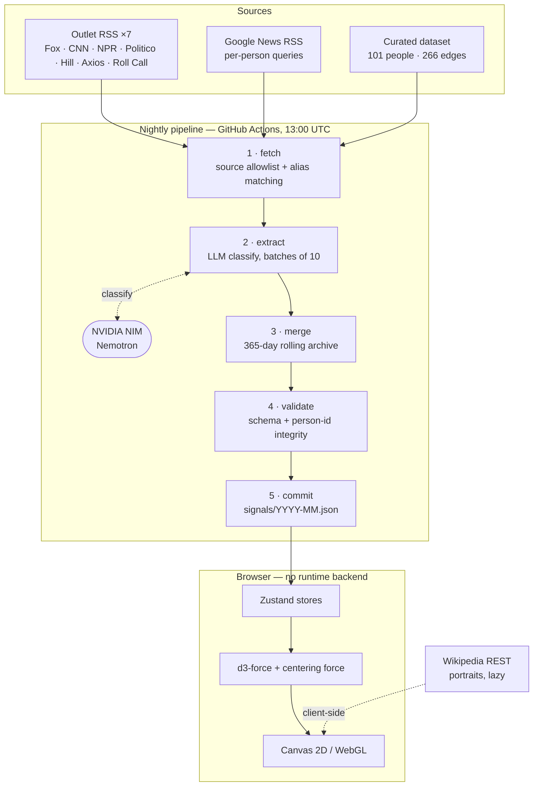

# POLARIS — U.S. Politician Relationship Atlas

**English** · [한국어](README.ko.md)

**An interactive graph of who in American politics is allied with whom, who is feuding with whom — and how those bonds flip over time.**

101 figures. 266 curated relationships, plus 112 co-sponsorship edges measured
directly from congressional bill records. A nightly pipeline that reads the political press, asks an LLM who just fell out with whom, and folds the answer into a rolling one-year archive. Fully bilingual (English / 한국어). No backend — the whole thing is static files.

### ▶ **[Try it live](https://world-politicians.vercel.app/)** · [Architecture](https://world-politicians.vercel.app/architecture) · [Source](https://github.com/showjihyun/world-politicians)

> Live at **[world-politicians.vercel.app](https://world-politicians.vercel.app/)** — no signup, works on mobile.

[](LICENSE)


---

### What it is

Most political coverage is a stream of isolated events. POLARIS is an attempt to render the *structure* underneath: a force-directed graph where every edge is a documented relationship — alliance, feud, bipartisan bridge, political family, mentorship — and where the news layer on top shows which of those edges are moving right now.

The thesis it makes visible: modern U.S. politics is a **hub-and-spoke network**, not two blocs. Remove the hub and the network doesn't split in two — it atomizes.

### Features

| | |
|---|---|
| **Relationship graph** | 2D canvas and 3D WebGL views of 101 figures across the executive branch, Senate, House, governorships, and non-elected power. Ctrl-drag to rotate in either mode. |
| **Legend as filter** | The legend at bottom-left *is* the control. Toggle a relationship type and those edges vanish while any node left without a visible tie dims — so you see what was filtered, not just a thinner graph. |
| **Live news wire** | Each profile shows recent articles that mention the person, classified by an LLM as alliance-leaning, feud-leaning, or neutral. |
| **Relationship timeline** | Track two people and the ANALYSIS tab draws a month-by-month strip of their relationship polarity, marking the turning points. A pair gets one vote per day rather than one per article, a flip has to outweigh the other side 2:1 to land, and a month the outlets split on is hatched instead of recoloured. Trump × Musk shows the June 2025 blow-up and the January 2026 Mar-a-Lago reconciliation. |
| **Source mix** | The insights panel breaks the whole archive down by outlet, names how concentrated it is, and says on the same line that polarity comes from the headline alone. |
| **Guided stories** | Seven curated tours through structural patterns — the Mar-a-Lago gravity well, the GOP civil war, the Democratic generational fight, endangered bipartisan bridges. |
| **Bilingual** | Every label, description, and LLM-generated summary exists in both English and Korean. The classifier writes both languages in a single pass. |
| **Data recency, visible** | A badge shows the actual date range of the articles in the dataset and how long ago the pipeline last ran — green under 24h, amber under 3 days, red beyond. |

### How it works



**Full technical write-up:** **[Architecture &amp; Data Flow](https://world-politicians.vercel.app/architecture)** — pipeline stages, rendering decisions, and the performance work, with diagrams. *(Source: [`docs/architecture.html`](docs/architecture.html) — GitHub renders it as source, so use the link above.)*

The short version:

1. **Fetch** — seven outlet RSS feeds directly, plus per-person Google News queries built from an alias table. Google News results pass an allowlist of 17 domains and 20 outlet names. Only articles naming two or more people in the dataset become pair candidates.
2. **Classify** — candidates go to an LLM in batches of ten, which returns the relevant pair, a polarity, a confidence score, and a bilingual summary. Without an API key the pipeline degrades to unclassified co-mention signals rather than failing.
3. **Merge** — new signals are unioned with the existing archive by stable id, trimmed to 365 days, capped at 1,500. A re-fetched article never overwrites a verdict the archive already holds, so a failed LLM batch costs nothing. A single run only sees a 30-day window; the archive is what makes the timeline possible. Output is written as monthly partitions (`src/data/signals/YYYY-MM.json`) plus a manifest and a small `recent.json`, so the browser loads the whole archive only when you open the timeline — the initial payload stays flat as the archive grows.
4. **Validate** — schema, count consistency, and that every referenced person id actually exists.
5. **Commit** — the workflow writes the JSON back to the repo. There is no server: the dataset ships as a static import.

### News sources

Signals are drawn only from these outlets — seven polled directly by RSS, the rest reached through Google News and filtered by an allowlist:

**Wires & networks** — Associated Press · Reuters · CNN · Fox News · NBC News · ABC News · CBS News · NPR
**Politics desks** — Politico · The Hill · Axios · Roll Call · Semafor · Washington Examiner
**Nationals** — The New York Times · The Washington Post · The Wall Street Journal

Portraits and biography links come from the **Wikipedia REST API**, fetched lazily in the browser. No image bytes are stored in this repo.

### Techniques worth stealing

- **Legend-as-filter with dimming.** Hiding edges alone makes a graph quietly wrong. Dimming the now-unconnected nodes makes the filter legible.
- **Fit to the core, not the outliers.** `zoomToFit` over every last node lets two strays shrink the real cluster into a corner. Fitting the core 97% by distance from the centroid keeps the graph filling the viewport on any monitor size.
- **A weak centering force.** Link-less nodes receive only charge repulsion and drift off-screen forever. A gentle pull toward the origin keeps the layout compact — and fixes the framing problem at its root.
- **Fit on engine stop, once.** Fitting on a timer frames coordinates that are still spreading. Fitting on *every* stop yanks the camera back each time the user rotates.
- **Cache 3D node objects; mutate materials for selection.** Building `nodeThreeObject` inline captures selection state, so every click rebuilt all 101 nodes' geometry and canvas textures — a 167 ms frame and a steady GPU leak. Caching by id and updating material colour in place: worst frame 50 ms, heap 69 → 40 MB.
- **Accumulate, never overwrite — including inside the merge.** The pipeline originally replaced its output each run, so a weak fetch could erase the archive; merging by id with a 365-day window fixed that. Only half of it: a re-fetched article whose LLM batch had failed came back unclassified and still won the merge, erasing a polarity the archive already held — 25 of them in one night, with no error and no log line. Silence has to mean *keep the old value*, and `npm run news:recover` pulled the lost verdicts back out of git history.
- **Match source names on word boundaries.** A bare `'AP'` in an allowlist, matched by substring, silently admits CoinG**ap**e, Yahoo News Sing**ap**ore, and Tele**grap**hHerald.
- **A check that matches nothing reports "pass."** Two audit rules compared numbers in this README against the data by regex. The sentences were reworded at some point, the patterns stopped matching, and the audit kept printing green — the Korean README had no live check at all. Zero matches and a clean pass are indistinguishable from the outside, which makes a dead check worse than no check: it buys confidence it isn't paying for. Every doc-number rule now reports when its pattern finds nothing, and every new check gets a deliberately wrong value fed to it before it is trusted.

### Running it

The dataset is committed, so the app runs with no API key and no network setup:

```bash
npm install
npm run dev          # http://localhost:5173
npm run build

npm test             # unit tests over the pure domain (~1s)
npm run audit        # boundary + data audit — decides by exit code
npm run e2e          # Playwright checks against a real browser (~90s)
npm run eval         # score the classifier against the label set

npm run news         # refresh news signals (needs NEWS_LLM_API_KEY)
npm run news:dry     # same, writes to a scratch file instead
npm run news:recover:dry   # preview verdicts recoverable from git history

node scripts/demo/record.mjs        # regenerate docs/demo.gif (needs ffmpeg)
```

`npm run audit` is the one that matters. It re-derives every number in this README from the
data and warns when they drift, checks that the domain layer imports no values, and refuses
manifests whose totals disagree with the partitions they summarise.

The LLM step expects an OpenAI-compatible endpoint. It defaults to NVIDIA NIM:

```
NEWS_LLM_API_KEY=...
NEWS_LLM_BASE_URL=https://integrate.api.nvidia.com/v1
NEWS_LLM_MODEL=nvidia/nemotron-3-ultra-550b-a55b
```

### Honest caveats

- **Two kinds of edge, drawn differently on purpose.** The 266 curated edges are an
  editorial claim ("these two are allies"). The co-sponsorship edges are a measurement
  ("they co-sponsored 78 bills in the 119th Congress"), built from GovInfo's BILLSTATUS
  bulk data and joined by `bioguide` id. They get their own dashed style and their own
  legend toggle, because blurring a judgment into a measurement costs you both. The
  threshold is 10 bills — at 5 it would add 264 edges and bury the curated set, and
  84% of pairs above 10 are same-party, so raw counts mostly re-encode party. The 11
  genuinely cross-party pairs are the interesting ones: Fitzpatrick × Gluesenkamp Perez
  (19 bills), Collins × Klobuchar (15), Lawler × Torres (12), Cruz × Warnock (9).
  Co-sponsorship is directional — B signs A's bill, not the other way round — so pairs
  that lean past 65% in one direction get an arrow (59 of 125); the rest are drawn as
  mutual. Collapsing that away made `Kim signs 15 of Warren's bills, Warren signs 0 of
  Kim's` look identical to `Padilla and Sanders, 15 each`.
  "Cross-party" here means a different *caucus*, not a different party label — Sanders
  and King are independents who caucus with the Democrats, and counting them as
  cross-party inflated this number from 11 to 19 in an earlier pass.
- **Money is on the profile, not the graph — and only 6% of it has a name.** FEC bulk
  data gives each figure's 2026-cycle receipts, their largest PAC funders, and outside
  spending. Three things sit in the same FEC file and must be separated: direct
  contributions ($32.0M), independent expenditures *supporting* a candidate ($14.4M),
  and independent expenditures *opposing* them ($18.1M). The opposing figure is the
  largest — merge them and the $10.1M spent attacking Thomas Massie reads as his
  funding. Joint fundraising transfers are excluded too, or Mike Johnson's top "donor"
  would be his own committee. What remains — PAC contributions — is 6% of total
  receipts; 73% is individual giving, reported only as a lump sum. The panel says so.
  It is not a graph layer because the data would not support one: only 5 pairs share
  8+ of their top funders, and all 5 are same-caucus.
- **The relationship data is editorial.** Those 266 edges are hand-curated from public reporting. Someone else reading the same coverage would draw a different graph. Treat it as an argument, not a record. Every edge now carries its own evidence panel — click the document icon on any relationship to see the articles behind it, or to see that there aren't any.
- **Evidence links are verifiable, and that cost coverage.** An earlier version attached 478 links to 218 edges — but 94% were Google News redirect URLs, which resolve only in a browser and carry no way to confirm the destination or the outlet. They were replaced with direct article URLs from the GDELT archive, each one relevance-filtered by an LLM and then actually fetched to confirm it resolves (5 dead links were caught and dropped). **64 of 266 edges have evidence, 162 links in all — every one a real outlet URL you can inspect before clicking.** The other 202 edges say plainly that they have no linked source.
- **Evidence is machine-filtered, not human-verified.** The LLM judges headlines, not article bodies, so marginal calls get through. Treat a linked article as supporting context, not as a citation someone checked.
- **Dates mean slightly different things per source.** News-signal dates come from the RSS `pubDate` (the publish date). Evidence-link dates come from GDELT's `seendate` — when GDELT crawled the article, usually within a day of publication but not identical to it. Recent coverage comes from Google News, older events from the GDELT archive (which reaches back to 2017) — the 48 remaining are mostly pre-2017 relationships that neither source can reach.
- **The LLM classifier is not a fact-checker.** It reads headlines and summaries, not full articles, and it is wrong sometimes. Polarity is a signal, not a verdict.
- **Its accuracy is measured, and it is not a baseline yet.** `npm run eval` scores the
  pipeline against a stratified label set: **84.7% on polarity and 87.3% on pairing across
  118 articles.** The errors are lopsided — 10 of 18 are a neutral article called a feud,
  and exactly one is a true ally/feud reversal. So the failure mode is not "it picks the
  wrong side," it is "it sees a fight where two names merely appear together." That is why
  a month now needs agreement across outlets and days to change colour, rather than one
  headline. The honest part: only 20 of those 118 answers were filled in by a person, and
  the rest were seeded by the same model being scored. Until human labels reach 40 the audit
  cannot fail on a regression, so read the figure as a floor to beat, not a score to trust.
- **The source mix is concentrated, and the wires barely register.** The whole archive comes from 17 outlets, but the top five carry 69% of it and AP plus Reuters together are 4.9% — a handful of politics desks decide what the classifier ever gets to see. The insights panel shows that breakdown rather than burying it, because this selection sits upstream of anything the classifier can get right.
- **The aggregation rules came out of that.** Because the mix is what it is, the news layer
  counts one vote per pair per day rather than one per article, wants a two-to-one margin
  before a month flips, and hatches months the outlets split on. Two further ideas — weighting
  outlets by how often they cry feud, and cross-checking against signed-triad balance — were
  measured here and dropped. Notes:
  [`docs/research/media-bias-literature.md`](docs/research/media-bias-literature.md).
- **Coverage skews to national English-language press**, and therefore toward the figures that press covers most.

### Deploying

The build is a static bundle, so anything that serves files will do. Two paths are wired up:

- **GitHub Pages** — `.github/workflows/pages.yml` publishes the app plus the architecture
  page. Its automatic trigger is commented out, since Pages is not enabled on this repo and the
  deploy step fails without it. To use it: repo *Settings → Pages → Source → GitHub Actions*,
  then restore the `push` trigger. The workflow sets `PAGES_BASE` so assets resolve under the
  `/world-politicians/` sub-path.
- **Vercel** — *currently live at [world-politicians.vercel.app](https://world-politicians.vercel.app/).* `vercel.json` is
  committed: import the repo and accept the defaults. It builds with `npm run build`, copies
  the docs into `dist/`, and serves from the domain root (no base path needed). Immutable
  caching on `/assets/*`, and `cleanUrls` drops the `.html` (hence `/architecture`).

### Where this is going

A reader asked whether this could grow to cover staffer networks, donor flows, lobbying
disclosures, and roll-call votes — mapping who actually influences federal decision-making.
It's the right question, and the honest answer has numbers attached: **84 of the 101 figures
match a current or former member of Congress — all 84 have roll-call records, 83 have an FEC id.**
But measured against edges rather than people, vote data reaches only the 145 relationships
with a legislator at both ends, out of 266. See [`docs/roadmap.md`](docs/roadmap.md)
for which sources are reachable today, why the join is the hard part, and what has to be
decided before any of it starts.

### Found an edge that's wrong?

Very possible — see the caveats above. Open an issue with the two people, what the edge
currently claims, and a link to reporting that contradicts it. Corrections to
`src/data/relationships.ts` are the most useful contribution to this repo.

### Stack

React 18 · TypeScript · Vite · Tailwind · Zustand · react-force-graph (d3-force + three.js) · Framer Motion · Playwright · Node 22 native TypeScript for the pipeline · GitHub Actions · deployed to Vercel

### License

MIT — see [LICENSE](LICENSE).

---

## Related

- **[showjihyun/KoreaPolitician](https://github.com/showjihyun/KoreaPolitician)** — the same idea applied to Korean politics.
