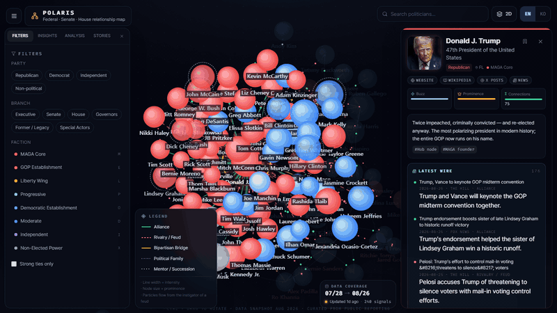
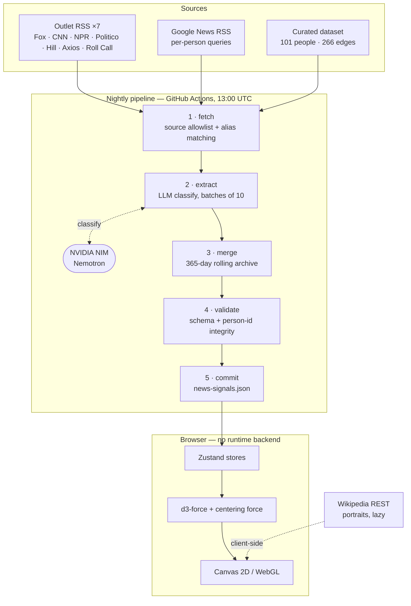

# POLARIS — U.S. Politician Relationship Atlas

**English** · [한국어](README.ko.md)

**An interactive graph of who in American politics is allied with whom, who is feuding with whom — and how those bonds flip over time.**

101 figures. 266 curated relationships. A nightly pipeline that reads the political press, asks an LLM who just fell out with whom, and folds the answer into a rolling one-year archive. Fully bilingual (English / 한국어). No backend — the whole thing is static files.

### ▶ **[Try it live](https://showjihyun.github.io/world-politicians/)** · [Architecture](https://showjihyun.github.io/world-politicians/architecture.html) · [Source](https://github.com/showjihyun/world-politicians)

[](LICENSE)




---

### What it is

Most political coverage is a stream of isolated events. POLARIS is an attempt to render the *structure* underneath: a force-directed graph where every edge is a documented relationship — alliance, feud, bipartisan bridge, political family, mentorship — and where the news layer on top shows which of those edges are moving right now.

The thesis it makes visible: modern U.S. politics is a **hub-and-spoke network**, not two blocs. Remove the hub and the network doesn't split in two — it atomizes.

### Features

| | |
|---|---|
| **Relationship graph** | 2D canvas and 3D WebGL views of 101 figures across the executive branch, Senate, House, governorships, and non-elected power. Ctrl-drag to rotate in either mode. |
| **Legend as filter** | The legend at bottom-left *is* the control. Toggle a relationship type and those edges vanish while any node left without a visible tie dims — so you see what was filtered, not just a thinner graph. |
| **Live news wire** | Each profile shows recent articles that mention the person, classified by an LLM as alliance-leaning, feud-leaning, or neutral. |
| **Relationship timeline** | Track two people and the ANALYSIS tab draws a month-by-month strip of their relationship polarity, marking the turning points. Trump × Musk shows the June 2025 blow-up and the January 2026 Mar-a-Lago reconciliation. |
| **Guided stories** | Seven curated tours through structural patterns — the Mar-a-Lago gravity well, the GOP civil war, the Democratic generational fight, endangered bipartisan bridges. |
| **Bilingual** | Every label, description, and LLM-generated summary exists in both English and Korean. The classifier writes both languages in a single pass. |
| **Data recency, visible** | A badge shows the actual date range of the articles in the dataset and how long ago the pipeline last ran — green under 24h, amber under 3 days, red beyond. |

### How it works



**Full technical write-up:** **[Architecture &amp; Data Flow](https://showjihyun.github.io/world-politicians/architecture.html)** — pipeline stages, rendering decisions, and the performance work, with diagrams. *(Source: [`docs/architecture.html`](docs/architecture.html) — GitHub renders it as source, so use the link above.)*

The short version:

1. **Fetch** — seven outlet RSS feeds directly, plus per-person Google News queries built from an alias table. Google News results pass an allowlist of 17 domains and 20 outlet names. Only articles naming two or more people in the dataset become pair candidates.
2. **Classify** — candidates go to an LLM in batches of ten, which returns the relevant pair, a polarity, a confidence score, and a bilingual summary. Without an API key the pipeline degrades to unclassified co-mention signals rather than failing.
3. **Merge** — new signals are unioned with the existing file by stable id, trimmed to 365 days, capped at 1,500. A single run only sees a 30-day window; the archive is what makes the timeline possible.
4. **Validate** — schema, count consistency, and that every referenced person id actually exists.
5. **Commit** — the workflow writes the JSON back to the repo. There is no server: the dataset ships as a static import.

### News sources

Signals are drawn only from these outlets — seven polled directly by RSS, the rest reached through Google News and filtered by an allowlist:

**Wires & networks** — Associated Press · Reuters · CNN · Fox News · NBC News · ABC News · CBS News · NPR
**Politics desks** — Politico · The Hill · Axios · Roll Call · Semafor · Washington Examiner
**Nationals** — The New York Times · The Washington Post · The Wall Street Journal

Portraits and biography links come from the **Wikipedia REST API**, fetched lazily in the browser. No image bytes are stored in this repo.

### Techniques worth stealing

- **Legend-as-filter with dimming.** Hiding edges alone makes a graph quietly wrong. Dimming the now-unconnected nodes makes the filter legible.
- **Fit to the core, not the outliers.** `zoomToFit` over every last node lets two strays shrink the real cluster into a corner. Fitting the core 97% by distance from the centroid keeps the graph filling the viewport on any monitor size.
- **A weak centering force.** Link-less nodes receive only charge repulsion and drift off-screen forever. A gentle pull toward the origin keeps the layout compact — and fixes the framing problem at its root.
- **Fit on engine stop, once.** Fitting on a timer frames coordinates that are still spreading. Fitting on *every* stop yanks the camera back each time the user rotates.
- **Cache 3D node objects; mutate materials for selection.** Building `nodeThreeObject` inline captures selection state, so every click rebuilt all 101 nodes' geometry and canvas textures — a 167 ms frame and a steady GPU leak. Caching by id and updating material colour in place: worst frame 50 ms, heap 69 → 40 MB.
- **Accumulate, never overwrite, time-series data.** The pipeline originally replaced its output each run, so a weak fetch could erase the archive. It merges by id with a 365-day window instead.
- **Match source names on word boundaries.** A bare `'AP'` in an allowlist, matched by substring, silently admits CoinG**ap**e, Yahoo News Sing**ap**ore, and Tele**grap**hHerald.

### Running it

The dataset is committed, so the app runs with no API key and no network setup:

```bash
npm install
npm run dev          # http://localhost:5173
npm run build

npm run news         # refresh news signals (needs NEWS_LLM_API_KEY)
npm run news:dry     # same, writes to a scratch file instead

node scripts/e2e/polaris.e2e.mjs    # 45 Playwright checks against a real browser
node scripts/demo/record.mjs        # regenerate docs/demo.gif (needs ffmpeg)
```

The LLM step expects an OpenAI-compatible endpoint. It defaults to NVIDIA NIM:

```
NEWS_LLM_API_KEY=...
NEWS_LLM_BASE_URL=https://integrate.api.nvidia.com/v1
NEWS_LLM_MODEL=nvidia/nemotron-3-ultra-550b-a55b
```

### Honest caveats

- **The relationship data is editorial.** Those 266 edges are hand-curated from public reporting. Someone else reading the same coverage would draw a different graph. Treat it as an argument, not a record.
- **The LLM classifier is not a fact-checker.** It reads headlines and summaries, not full articles, and it is wrong sometimes. Polarity is a signal, not a verdict.
- **Coverage skews to national English-language press**, and therefore toward the figures that press covers most.

### Deploying

The build is a static bundle, so anything that serves files will do. Two paths are wired up:

- **GitHub Pages** — `.github/workflows/pages.yml` builds on every push to `main` and
  publishes the app plus the architecture page. One-time setup: repo *Settings → Pages →
  Source → GitHub Actions*. The workflow sets `PAGES_BASE` so assets resolve under the
  `/world-politicians/` sub-path.
- **Vercel** — `vercel.json` is committed. Import the repo and accept the defaults; it
  builds with `npm run build`, copies the docs into `dist/`, and serves from the domain
  root (no base path needed). Immutable caching on `/assets/*`.

### Found an edge that's wrong?

Very possible — see the caveats above. Open an issue with the two people, what the edge
currently claims, and a link to reporting that contradicts it. Corrections to
`src/data/relationships.ts` are the most useful contribution to this repo.

### Stack

React 18 · TypeScript · Vite · Tailwind · Zustand · react-force-graph (d3-force + three.js) · Framer Motion · Playwright · Node 22 native TypeScript for the pipeline · GitHub Actions · deployed to GitHub Pages

### License

MIT — see [LICENSE](LICENSE).

---

## Related

- **[showjihyun/KoreaPolitician](https://github.com/showjihyun/KoreaPolitician)** — the same idea applied to Korean politics.
